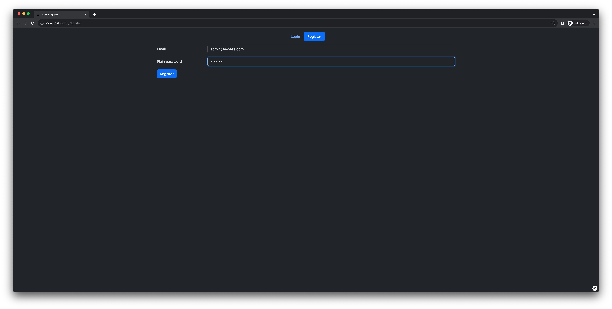
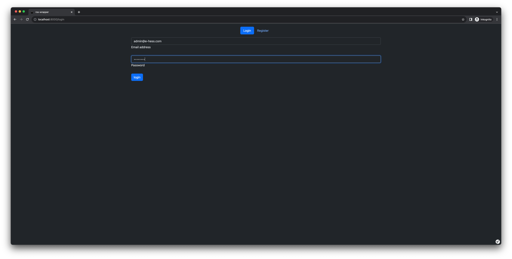
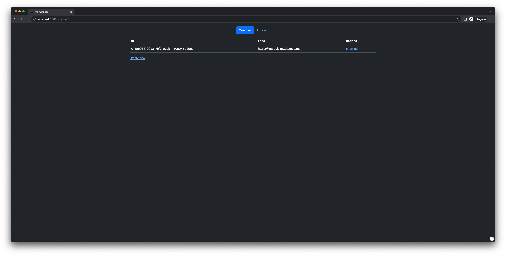
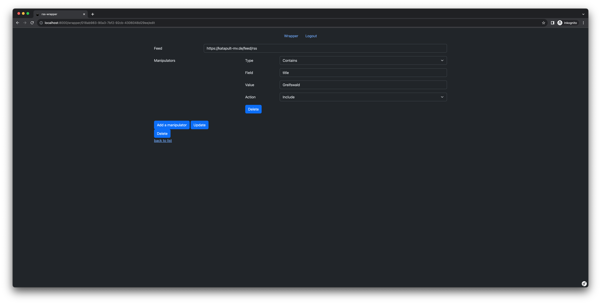
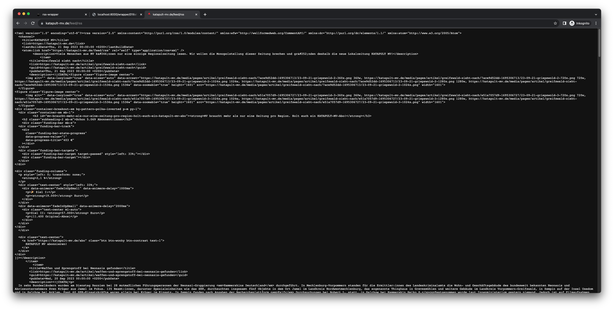
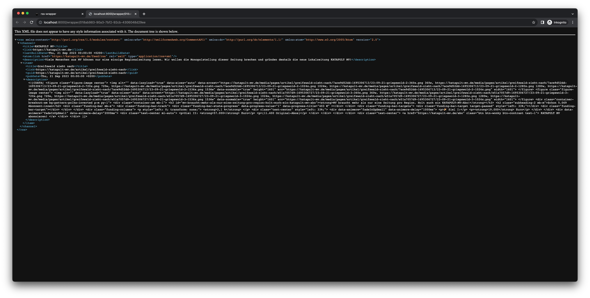

# A simple rss feed wrapper and manipulator

The `rss-wrapper` lets you determine which entries you want to have in your RSS feed. For example, if you only want to have entries with the word "Super Cool" in the title, you can create a wrapper for an existing RSS feed and simply filter out all other entries. How does this work? Here is a short explanation.

[Example (https://rss-wrapper.e-hess.com)](https://rss-wrapper.e-hess.com)

## Quick Start

### Docker

```bash
docker run -it --rm \
    --publish 8080:8080 \
    ghcr.io/eric-hess/rss-wrapper:latest
```
Now you can access the webpage via the following link: `http://localhost:8080`

If you want to store create user and feed wrapper across update and migrations, you should consider to mount a volume for the sqlite database.

```bash
docker run -it --rm \
    --publish 8080:8080 \
    --volume $PWD/database:/opt/app/var/database \
    ghcr.io/eric-hess/rss-wrapper:latest
```

### Docker Compose
```yml
services:
    rss-wrapper:
        image: ghcr.io/eric-hess/rss-wrapper:latest
        restart: unless-stopped
        volumes:
          - ./database:/opt/app/var/database
        environment:
          - APP_SECRET=change-me
          - APP_ENABLE_REGISTRATION=false
        ports:
            - 8080:8080
```
## Available env variables

| variable name             | default value                                         | description                                                                                                                                                                                                                                                                            |
|---------------------------|-------------------------------------------------------|----------------------------------------------------------------------------------------------------------------------------------------------------------------------------------------------------------------------------------------------------------------------------------------|
| `APP_SECRET`              | `change-me`                                           | Secret key used to enhance the security of the application. It is used for tasks such as session security, CSRF protection, and data encryption                                                                                                                                        |
| `DATABASE_URL`            | `sqlite:///%kernel.project_dir%/var/database/data.db` | The database connection string. Default a sqlite database is used                                                                                                                                                                                                                      |
| `APP_ENABLE_REGISTRATION` | `true`                                                | Determines if new user should have the ability to create a account in order to create wrapper. If the registration is disabled new user accounts can be created with a cli command in the container `php82 /opt/app/bin/console app:create-user --email=<email> --password=<password>` |

## Screenshots

### register


### login


### wrapper list


### wrapper edit


### original feed


### wrapped feed
